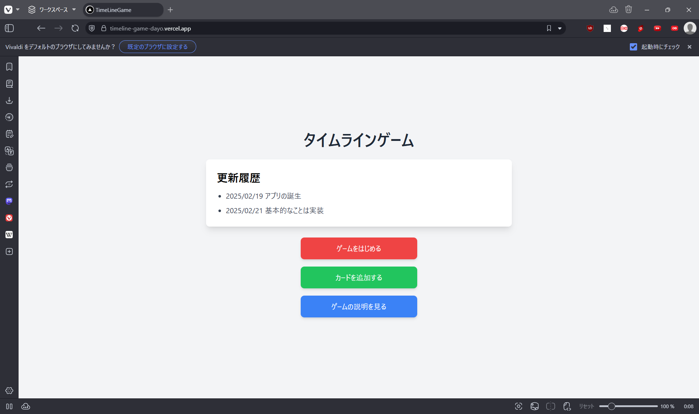

# TimeLine Game

TimeLine Game(以下タイムラインゲーム)とは，与えられたカードに書かれた歴史上の出来事を，時系列順に並べるゲームです．

https://timeline-game-dayo.vercel.app
で公開中

## 動機

タイムラインゲームはマイナーよりで，面白いゲームにも関わらず，オンラインで遊べるものが全然なく，ないなら作ってしまおうということで作成しました．

## 特徴と動作

特徴は以下のとおりです．

- シンプルな画面
- カードが動かせる！
- カードが自由に追加できる

ホーム画面は以下のとおりです．

### 「ゲームをはじめる」を押したあとの動作

- 正解の場合

<video src="for_readme/correct.mp4" controls="true"></video>

- 不正解の場合

<video src="for_readme/incorrect.mp4" controls="true"></video>

### 「カードを追加する」を押したあとの動作

<video src="for_readme/addcard.mp4" controls="true"></video>

## 技術スタック

- 使用した言語
  - TypeScript
- 使用したフレームワーク
  - React, Next.js, Prisma
- 使用したツールやWebサービス
  - VScode, Supabase, Vercel

## 工夫した点・苦労した点

- カードを自由に動かし，目標の場所にしっかりと配置すること．

## 今後について

- ユーザー登録の実装
- ユーザごとにデッキを作成
- カードのデザイン
- 対戦機能の実装
  - それぞれのユーザーが作成したカードに対しての評価(良いカード，悪いカードなど)を実装．
  - 評価が高いカードで対戦を行う．
- 携帯などの端末にも対応する
